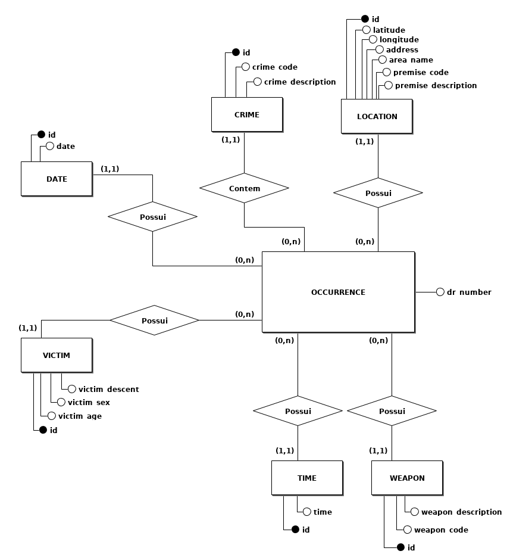
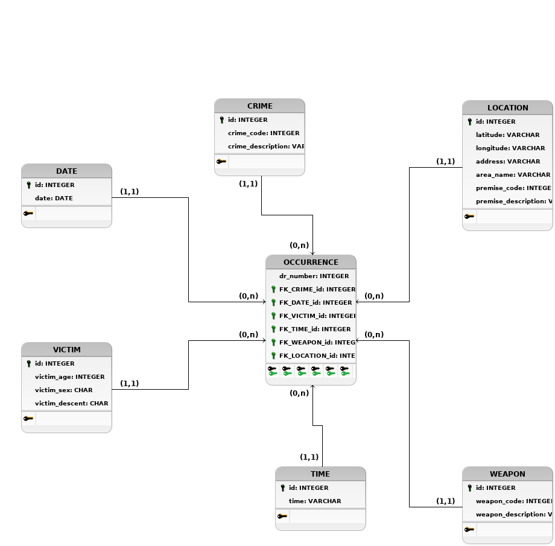

# LA-Crime-Data-BD2
Repository for activities related to the project of the discipline "Banco de Dados 2".  

### Group Members:
Ewerson Vieira Nascimento (ewersonv@gmail.com)  
Willian Vaneli (willianvaneli@gmail.com)  

## Presentations
[Main](main.pptx)  
[Data Mining](data-mining.pptx)

### Database
[Kaggle](https://www.kaggle.com/cityofLA/los-angeles-crime-arrest-data)  

### Drive
[Folder](https://drive.google.com/drive/folders/1Ew5wzFAtJyR45iBYXEVI1P-biqJlzNMn)

### Conceptual Model

### Logic Model

### Data dictionary
Dimension *Crime*
- <b>id</b>: identifier provided by technical key on Pentaho.
- <b>crime_code</b>: indicates the crime committed according to the LA crime code system.
- <b>crime_description</b>: defines the crime code provided.

Dimension *Date*
- <b>id</b>: identifier provided by technical key on Pentaho.
- <b>date</b>: dates from 2010 to 2019 in the format yyyy-MM-dd.

Dimension *Location*
- <b>id</b>: identifier provided by technical key on Pentaho.
- <b>latitude</b>: latitude of the crime scene.
- <b>longitude</b>: longitude of the crime scene.
- <b>address</b>: address of the crime scene.
- <b>area_name</b>: name of the area where the crime occurred, according to the LA determined areas.
- <b>premise_code</b>: code of the premise where the crime occurred.
- <b>premise_description</b>: description of the premise where the crime occurred (hotel, family dwelling, department store, etc.).

Dimension *Time*
- <b>id</b>: identifier provided by technical key on Pentaho.
- <b>time</b>: string containing the hour and minute the crime was reported (0700, 2200, 2045, etc.).

Dimension *Victim*
- <b>id</b>: identifier provided by technical key on Pentaho.
- <b>victim_age</b>: age of the victim of the crime.
- <b>victim_sex</b>: sex of the victim of the crime (M/F).
- <b>victim_descent</b>: ethnicity of the victim of the crime.

Dimension *Weapon*
- <b>id</b>: identifier provided by technical key on Pentaho.
- <b>weapon_code</b>: code of the weapon used on the crime.
- <b>weapon_description</b>: description of the weapon used on the crime.

Fact *Occurrence*
- <b>dr_number</b>: Division of Records Number. Official file number made up of a 2 digit year, area ID, and 5 digits.

### Pentaho
[Step by step](steps-pentaho/README.md)