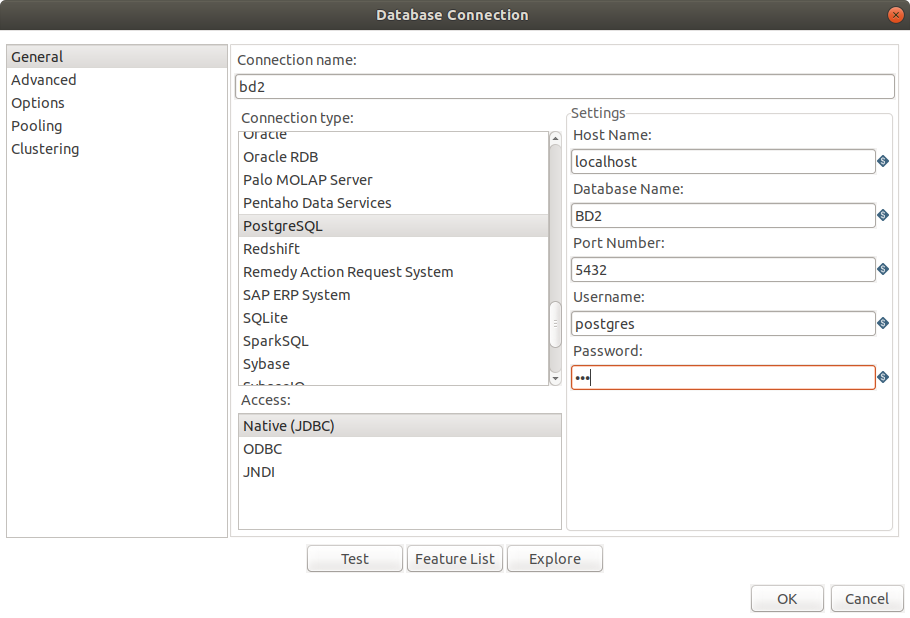

# Step by step Pentaho

In this tutorial you will be shown how we made our transformations on Pentaho to create our dimensional tables and our fact table. We'll approach only the dimensions *Date* and *Location* so that this tutorial doesn't get too long.

### Dimension Date
To create the dimension Date you'll need to use the following steps:
- CSV file input
- Split fields
- Sort rows
- Unique rows
- Dimension lookup/update

You'll use two <b>CSV file input</b> steps, each one followed by a <b>Split fields</b> step. Then you set the main output of both previous steps into one <b>Sort rows</b> step, followed by a <b>Unique rows</b> step and, finally, a <b>Dimension lookup/update</b> step. In the image below we can see how it looks:


#### 1. Opening the .CSV

The first thing we need to do is open our .csv in the <b>CSV file input</b> step.


You must specify the path of the file you want to open in the <b>Filename</b> field. Let the <b>Delimiter</b> be a ```,``` so you can get the fields properly by clicking on <b>Get fields</b>. You can also change the step name so it's easier to know which field you're dealing with.

As said before, you'll have to do this step twice: one for the *Date Reported* field and another for the *Date Occurred* field.

Remove all the fields we won't use so that your step looks just like the image above and then hit <b>OK</b>.

#### 2. Spliting the data

The reason you have to do this step is because in the .csv we're using, the fields that have a date format (*Date Reported* and *Date Occurred*) comes this way:

```bash
2013-09-20T00:00:00
```

The values after T doesn't change throughout the data in this .csv, so we did a split in this field to get only the useful information, which is the date itself.

With that in mind, you must set the <b>Field to split</b> according to the previous field you used on the input file. Set the <b>Delimiter</b> as T and then create a <b>New Field</b> using the name of your choice (here we used *date*). <b>IMPORTANT</b>: The name of the new field must be the same on both <b>Split fields</b> step.

Set the <b>Type</b> as Date and the <b>Format</b> as ```yyyy-MM-dd```. Hit <b>OK</b>.


Repeat the steps above to get the *Date Occured* dates.

#### 3. Sorting the rows

You must use this step so you can use the <b>Unique Rows</b> step afterwards.

Here all you have to do is click on <b>Get fields</b> and hit <b>OK</b>.


#### 4. Getting only unique rows

On fields *Date Reported* and *Date Occurred* there are repeated dates. In the previous step you just put both together in a field called *date* and ordered it. Now you must remove the repeated dates for the atomicity of the database. You'll do this by using the <b>Unique rows</b> step.

All you have to do is click on <b>Get</b> again and then hit <b>OK</b>.


#### 5. Creating the dimension *Date*

Now you're in the final part. Set the main output of the previous step to the <b>Dimension lookup/update</b> step. Here the first thing you have to do is create a new <b>Connection</b> to the DBMS you're using. In our project we used PostgreSQL and the connection looks like this:



After that, mark the <b>Update the dimension?</b> box and set the table where the data will be stored. On <b>Keys</b>, set the <b>Dimension field</b> with the name of your choice and put *date* on <b>Field in stream</b>. The last thing to do is set the <b>Technical key field</b>. You can use the name you want for it. The technical key holds the ID for each data inserted into the table you specified.


Hit <b>OK</b> and run the transformation.

### Other Dimensions

The steps you'll follow to create the other dimensions are very similar to the ones you saw above. The differences are:
- The dimension *Location* needs a sequence of three <b>Split fields</b> so you can get the *Latitude* and the *Longitude* correctly. This is how the field containing both comes from the .csv: ```"{'longitude': '-118.2574', 'human_address': '{""address"":"""",""city"":"""",""state"":"""",""zip"":""""}', 'needs_recoding': False, 'latitude': '34.0277'}"```
- The other dimensions doesn't need a <b>Split fields</b> step. The transformation will be very similar. Instead of passing the values through a <b>Split fields</b> step, we simply put the main output of the <b>CSV input file</b> as the <b>Sort rows</b> step.

Here is a image showing how our *Location* transformation look:


All the transformations we made on this project can be found on the folder [transformations](transformations/).

### Fact Occurrence